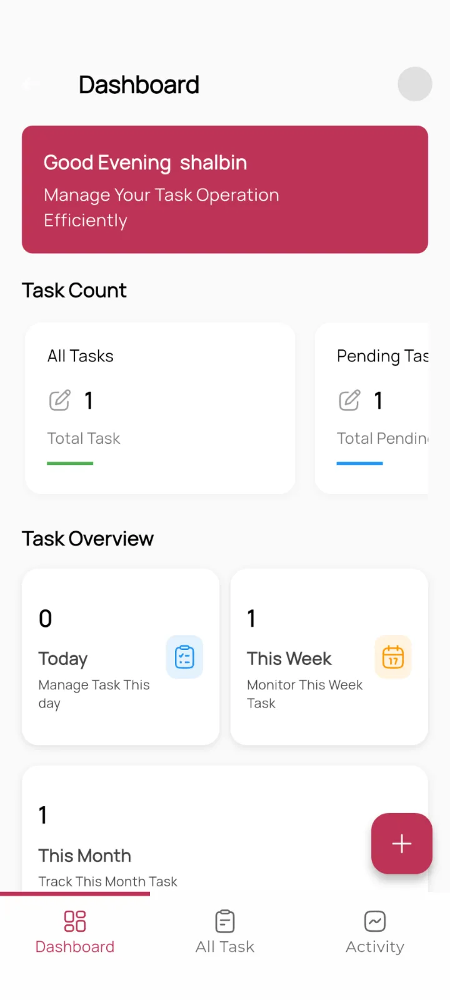
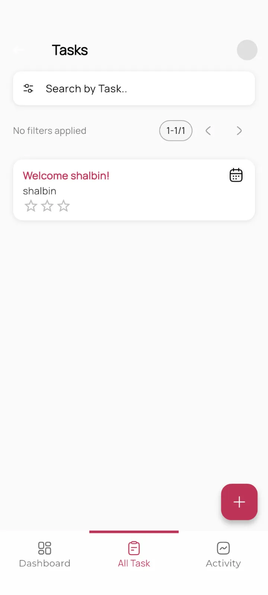
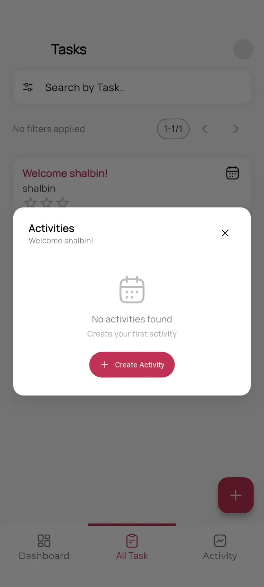
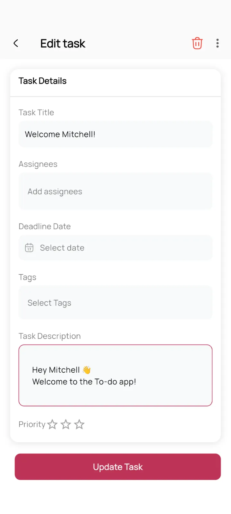

# Mobo Todo


Mobo Todo is a feature-rich mobile application built to seamlessly integrate with Odoo's task management and project modules, empowering users to manage their daily workflows from a sleek, intuitive Flutter interface. From creating new tasks and organizing activities, to monitoring task completion and managing schedules, Mobo Todo keeps your productivity on track — right from your pocket

## Key Features

### Task Management
- **Full Task Lifecycle**: Create, update, complete, and track tasks directly from the app.
- **Activity Tracking**: Monitor the status of every activity and task in real time.
- **Detailed Task Views**: View and manage all task details, including rich text descriptions, deadlines, and active status.
- **Quick Add**: Rapidly create new tasks using the dedicated Add Task screen.

### Organization & Scheduling
- **Dashboard Overview**: At-a-glance overview of your task performance and pending items upon login.


### Profile & Settings
- **User Management**: View and update profile settings natively within the app.
- **Onboarding Experience**: Intuitive multi-step onboarding for first-time users.
- **Personalized Dashboards**: Easily navigate and tune the app behavior in the settings screen.

### Security & User Experience
- **Biometric Authentication**: Secure and fast login using fingerprint or Face ID.
- **Multi-Company Support**: Easily switch between different company profiles and Odoo 

## Screenshots


<div>
  
  
  
  
</div>


## Technology Stack

Mobo Todo is built using modern technologies to ensure reliability and performance:

- **Frontend**: Flutter (Dart)
- **State Management**: Provider
- **Local Database**: Isar (High-performance NoSQL database)
- **Backend Integration**: Odoo RPC
- **Authentication**: Local Auth (Biometrics) & Odoo Session Management
- **Navigation**: Snake Navigation Bar & Core Routing
- **Media & UI Components**: Cached Network Image, Carousel Slider, Video Player, Flutter HTML, Lottie
- **Networking/Sync**: HTTP, Connectivity Plus, Shimmer Effects

## Getting Started

### Prerequisites
- Flutter SDK (Latest Stable)
- Odoo Instance (v17 or higher recommended, Project/To-Do modules enabled)
- Android Studio or VS Code

### Installation

1. **Clone the repository**
   ```bash
   git clone https://github.com/mobo-suite/mobo_todo.git
   cd mobo_todo
   ```

2. **Install dependencies**
   ```bash
   flutter pub get
   ```

3. **Generate code bindings**
   Run the build runner to generate necessary code for Isar and JSON serialization:
   ```bash
   dart run build_runner build --delete-conflicting-outputs
   ```

4. **Run the application**
   ```bash
   flutter run
   ```

## Configuration

1. **Server Connection**: Upon first launch, enter your Odoo server URL and database name.
2. **Authentication**: Log in using your Odoo credentials. You can enable biometric login in the settings for faster access.
3. **Module Activation**: Ensure tasks or to-do management is properly configured on your Odoo instance before connecting.

## Permissions

The app may request the following device permissions:

| Permission | Purpose |
|---|---|
| **Internet** | Sync data with the Odoo server |
| **Camera / Storage** | Pick images or files to attach to tasks |
| **Biometrics** | Fingerprint / Face ID authentication |

## Build Release

### Android
```bash
flutter build apk --release
```
The APK will be generated at `build/app/outputs/flutter-apk/app-release.apk`.

For an App Bundle (recommended for Play Store):
```bash
flutter build appbundle --release
```

### iOS
```bash
flutter build ios --release
```
Open `ios/Runner.xcworkspace` in Xcode to archive and distribute.

## Usage

1. Launch the **Mobo Todo** app on your device.
2. Enter your **Odoo server URL** (e.g., `https://your-odoo-domain.com`).
3. Select your **database** from the dropdown list.
4. Log in with your **Odoo credentials**.
5. Enable **biometric login** (optional) in Settings for faster access.
6. Manage your **Tasks**, update statuses, view activities, and coordinate efficiently.

## Troubleshooting

### Login Failed
- Double-check your server URL (include `https://`).
- Verify the database name is correct.
- Ensure the user account has access to the tasks/project module in Odoo.

### No Data Loading
- Check your internet / VPN connection.
- Verify Odoo API access is enabled.
- Review server logs for any access or permission errors.

### Biometric Login Not Working
- Ensure biometrics are enrolled on the device.
- Re-enable biometric login in the app Settings.

## Roadmap

- [ ] **Push Notifications** — Receive real-time alerts for task assignments and upcoming deadlines
- [ ] **Collaborative Assigning** — Ability to multi-assign and tag other users in task discussions directly from the app
- [ ] **Time Tracking** — Start and stop timers on specific tasks synced back to Odoo Timesheets
- [ ] **Advanced Filtering** — Custom filter creation for specific projects, tags, or deadlines
- [ ] **Widget Support** — Native Android/iOS home screen widgets for quick viewing of daily todos

## Maintainers

Developed and maintained by **Team Mobo** at [Cybrosys Technologies](https://www.cybrosys.com).

📧 [mobo@cybrosys.com](mailto:mobo@cybrosys.com)

## Contributing

We welcome contributions to improve Mobo Todo!
1. Fork the project.
2. Create your feature branch (`git checkout -b feature/NewFeature`).
3. Commit your changes (`git commit -m 'Add NewFeature'`).
4. Push to the branch (`git push origin feature/NewFeature`).
5. Open a Pull Request.

## License

This project is primarily licensed under the **Apache License 2.0**.  
It also includes third-party components licensed under:
- **MIT License**
- **GNU Lesser General Public License (LGPL)**

See the [LICENSE](LICENSE) file for the main license and [THIRD_PARTY_LICENSES.md](THIRD_PARTY_LICENSES.md) for details on included dependencies and their respective licenses.
